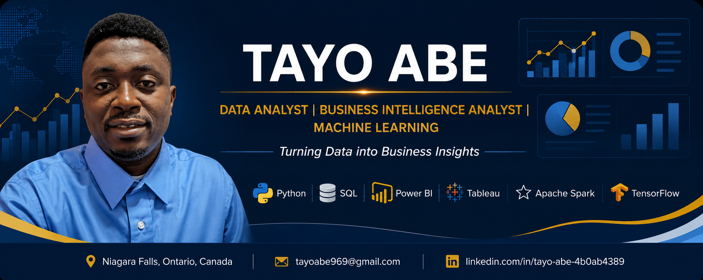

  

# Hi, I'm Tayo Abe 👋

🎓 **MSc Data Analytics Candidate** | University of Niagara Falls Canada *(Expected Graduation: October 2026)*

📍 Niagara Falls, Ontario, Canada

📊 **Data Analyst | Business Intelligence Analyst | Turning Data into Business Insights**

I am a Data Analytics graduate student with hands-on experience delivering end-to-end analytics solutions across business intelligence, machine learning, data visualization, predictive analytics, and big data. I enjoy transforming raw data into actionable insights that help organizations make informed decisions and improve business performance.

My portfolio includes real-world projects involving Python, SQL, Power BI, Tableau, Apache Spark, Streamlit, TensorFlow, and R, covering domains such as public safety, retail analytics, healthcare, marketing, finance, and sales forecasting.

I am currently seeking opportunities as a **Data Analyst**, **Business Intelligence Analyst**, or **Junior Data Scientist**, where I can combine analytical thinking with technical skills to solve business problems.

---

# 🚀 Technical Skills

### Programming & Query Languages

- Python
- SQL
- R

### Data Analysis & Visualization

- Power BI
- Tableau
- Microsoft Excel
- Matplotlib
- Seaborn
- Streamlit

### Machine Learning & AI

- Scikit-learn
- TensorFlow
- Keras
- Classification
- Regression
- Clustering
- Neural Networks

### Big Data & Cloud

- Apache Spark
- Databricks

### Databases

- MySQL
- SQL Server

### Tools

- Git
- GitHub
- Jupyter Notebook
- VS Code

---

# 📂 Featured Projects

## 📊 Toronto Crime Indicators Analytics Tool

Interactive Streamlit application for analyzing crime trends, police division activity, and premises distribution to support public safety decision-making.

---

## 🤖 Health Risk Prediction using Neural Networks

Deep learning model developed using TensorFlow and Keras to predict patient health risks from clinical data.

---

## ☁️ Amazon Fine Food Reviews Analytics

Large-scale big data analytics project using Apache Spark and Databricks to analyse over 568,000 customer reviews and generate business insights.

---

## 📈 Retail Customer Insights & Predictive Analytics

Machine learning project applying customer segmentation and predictive analytics to identify customer groups and support marketing strategies.

---

## 📱 Smartphone Market Analysis Dashboard

Interactive Power BI dashboard providing insights into smartphone market performance, trends, and business metrics.

---

## 📉 Sales Forecasting Dashboard

Business Intelligence dashboard developed in Power BI for forecasting sales performance and monitoring key performance indicators.

---

# 🌱 Currently Working On

- Master's Capstone Project: **Marketing Campaign Performance Analytics**
- Advanced Machine Learning
- Business Intelligence Portfolio Development
- Open Source GitHub Portfolio

---

# 📬 Let's Connect

- 💼 LinkedIn: www.linkedin.com/in/tayo-abe-4b0ab4389
- 📧 Email: tayoabe969@gmail.com

---

⭐ Thank you for visiting my GitHub profile!

Feel free to explore my repositories, connect with me on LinkedIn, or reach out if you'd like to collaborate on analytics, machine learning, or business intelligence projects.
